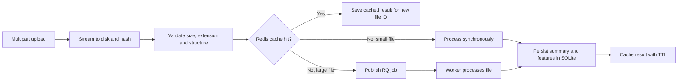

# Geospatial File Measurement API

A FastAPI service that accepts KML and zipped Shapefile uploads, extracts their features, calculates CRS-aware area or length measurements, and returns the results through an HTTP API.

## Features

- Stream uploads to disk, validate supported file types, and calculate a SHA-256 digest as each file arrives.
- Measure Polygon and MultiPolygon area in square metres and LineString and MultiLineString length in metres.
- Retain parsed feature geometry, attributes, CRS labels, measurements, and file summaries in SQLite.
- Cache results in Redis for 24 hours by default, and queue uploads larger than 5 MiB through RQ.
- Serve a browser dashboard at `/` for uploads, job polling, measurement summaries, and raw API responses.
- Provide JSON logs, a health endpoint, an OpenAPI page, automated tests, a Locust load profile, and a Docker Compose deployment.

Supported uploads are `.kml` and `.zip` archives containing matching `.shp`, `.shx`, and `.dbf` Shapefile components. Point features are returned with `UNSUPPORTED_GEOMETRY`; point-to-point distance is not implemented yet.

## Setup

### Run locally

Use Python 3.12 or newer (3.10+ is supported). In PowerShell:

```powershell
py -3.12 -m venv .venv
.venv\Scripts\Activate.ps1
python -m pip install -r requirements.txt
python -m uvicorn app.main:app --reload
```

The API listens at `http://127.0.0.1:8000`; interactive documentation is at `http://127.0.0.1:8000/docs`.

Redis is optional for small synchronous uploads: cache reads/writes fail open, and processing continues without the cache. Redis is required for cache hits and for accepting uncached large uploads. To use the RQ worker locally, run a Redis server and in a second terminal:

```powershell
$env:REDIS_URL = "redis://localhost:6379/0"
rq worker-pool --url $env:REDIS_URL --num-workers 1 --worker-class rq.worker.SpawnWorker --serializer json geospatial-measurements
```

The Windows worker-pool command uses RQ's spawn worker. On Linux or macOS, use `rq worker --url $env:REDIS_URL --serializer json geospatial-measurements`.

### Run with Docker Compose

Docker Compose starts the API, Redis, and one worker. The API and worker share a persistent volume for SQLite and uploaded files; Redis uses a separate volume.

```powershell
docker compose up --build
```

Open `http://127.0.0.1:8000/` for the browser dashboard, `/health` for the health check, or `/docs` for the interactive API docs. Set `API_PORT`, `CACHE_TTL_SECONDS`, or `ASYNC_THRESHOLD_BYTES` before starting Compose to change the host port, cache lifetime, or async threshold. Stop the stack with `Ctrl+C`, then run `docker compose down`; named volumes are retained.

### Configuration

| Variable | Default | Purpose |
| --- | --- | --- |
| `REDIS_URL` | `redis://localhost:6379/0` | Redis connection for cache and RQ |
| `DATABASE_PATH` | `data/geospatial.sqlite3` | SQLite database location |
| `UPLOAD_DIRECTORY` | `data/uploads` | Stored uploads location |
| `MAX_UPLOAD_SIZE_BYTES` | `104857600` | Maximum upload size (100 MiB) |
| `ASYNC_THRESHOLD_BYTES` | `5242880` | Uploads above this size are queued (5 MiB) |
| `CACHE_TTL_SECONDS` | `86400` | Redis result cache lifetime (24 hours) |

## API

### `GET /health`

Returns `200 OK` when the API process is responding.

```json
{"status":"ok"}
```

### `POST /api/v1/measure`

Upload one file as `multipart/form-data` with a `file` field:

```powershell
curl.exe -F "file=@survey.kml" http://127.0.0.1:8000/api/v1/measure
```

For a synchronous upload (HTTP `201 Created`):

```json
{
  "id": "<file-id>",
  "filename": "survey.kml",
  "size_bytes": 1234,
  "feature_count": 1,
  "crs": "EPSG:4326",
  "status": "COMPLETED"
}
```

When a matching SHA-256 result is cached, the same response also has `"cache_hit": true`; the result is saved under the new upload ID and filename. Uploads larger than the configured threshold normally return HTTP `202 Accepted`:

```json
{
  "job_id": "<job-id>",
  "status": "QUEUED",
  "status_url": "/api/v1/measure/<job-id>"
}
```

Malformed, unsupported, empty, oversized, or unreadable uploads return HTTP `400`. A large uncached upload returns `503` if the Redis queue cannot accept it.

### `GET /api/v1/measure/{job_id}`

Poll a large upload. While it is processing:

```json
{"job_id":"<job-id>","file_id":"<file-id>","status":"RUNNING"}
```

When complete, the response includes the summary and feature list:

```json
{
  "job_id": "<job-id>",
  "file_id": "<file-id>",
  "status": "COMPLETED",
  "result": {
    "file": {"id":"<file-id>","filename":"survey.kml","feature_count":1,"crs":"EPSG:4326","status":"COMPLETED"},
    "features": [
      {"index":0,"geometry_type":"Polygon","measurement":{"type":"area","value":12300,"unit":"square_metres","crs":"EPSG:32631"},"measurement_status":"MEASURED"}
    ]
  }
}
```

The `result.file` object also contains `size_bytes`. Failed jobs return `status: FAILED` and a safe `error` message. Unknown job IDs return `404`.

### `GET /api/files/{id}/`

Get a stored file summary:

```json
{"id":"<file-id>","filename":"survey.kml","size_bytes":1234,"feature_count":1,"crs":"EPSG:4326","status":"COMPLETED"}
```

### `GET /api/files/{id}/measurements/`

Get extracted feature geometry, properties, CRS, and measurements:

```json
{
  "id": "<file-id>",
  "feature_count": 1,
  "crs": "EPSG:4326",
  "features": [
    {
      "index": 0,
      "id": "1",
      "layer": "Placemarks",
      "geometry_type": "Polygon",
      "crs": "EPSG:4326",
      "properties": {"Name":"field"},
      "measurement": {"type":"area","value":12300,"unit":"square_metres","crs":"EPSG:32631"},
      "measurement_status": "MEASURED"
    }
  ]
}
```

Unknown file IDs return `404`. Point and other unsupported feature types are still returned, with a null measurement and a status explaining why they were not measured.

## Architecture

### Application structure

- `app/main.py` — FastAPI lifecycle, HTTP routes, and request/error handling.
- `app/uploads.py` — chunked upload persistence, size/type checks, and KML/Shapefile ZIP validation.
- `app/geoprocessing.py` — Pyogrio layer reading and Shapely/PyProj feature measurements.
- `app/cache.py` — SHA-256 keyed Redis result cache with configurable TTL.
- `app/jobs.py` — RQ publishing and background job execution.
- `app/repository.py` — SQLite persistence for file summaries, features, and job state.
- `app/logging_config.py` — structured JSON logs.
- `frontend/index.html` — lightweight upload and results dashboard served at `/`.
- `tests/` — geometry unit and API integration tests.
- `locustfile.py` — concurrent KML upload benchmark profile.
- `Dockerfile`, `docker-compose.yml` — container build and API/Redis/worker services.

### File-processing flow



Small uploads are parsed in the request flow. Large uploads are accepted as jobs and processed by a worker. Clients poll the job status route. Results are persisted in SQLite, and Redis caches content-addressed results to avoid repeating measurements.

### Measurement calculation and CRS handling

Pyogrio reads each file's layers and feature fields; Shapely provides geometry types, transforms, and metric geometry operations. PyProj transforms each supported geometry from its source CRS to a local projected CRS before measuring it. The code selects a UTM zone from the feature location for common latitudes, and a local equal-area or equidistant projection for polar polygons or lines.

KML is treated as EPSG:4326 if the reader does not report its standard CRS. Shapefile CRS is taken from its metadata, usually the accompanying `.prj`. If a Shapefile has no CRS, its features are returned with `CRS_UNKNOWN` and no metric value; the API does not guess units. Polygon area and line length are calculated per feature. Point-to-point distance and polygon perimeter are not currently exposed.

## Design decisions

| Decision | Reason | Alternative considered |
| --- | --- | --- |
| FastAPI with Pyogrio, Shapely, and PyProj | Python API development with geospatial work handled by compiled libraries and explicit CRS transforms | Go/Rust web frameworks or a PostGIS processing service |
| Stream uploads to disk before parsing | Bounds memory use and allows large files to move to background workers | Read each multipart body fully into memory |
| Redis plus RQ for large files | Keeps long measurements out of request handling and supports polling | Process every file synchronously or add a more complex broker such as RabbitMQ |
| SQLite for persisted results | Keeps the initial deployment small and easy to run locally | PostgreSQL/PostGIS for multi-host concurrency and spatial queries |
| SHA-256 content cache with a 24-hour TTL | Identical inputs can reuse expensive results without an unbounded cache | Cache by filename (can collide for different contents) or do not cache |
| Python slim multi-stage Docker image | Keeps build dependencies out of the runtime image while retaining compatibility with geospatial wheels | Distroless/Alpine images, which require extra validation for native geospatial dependencies |

## Tests and load testing

Run geometry unit tests and API integration tests with:

```powershell
python -m pip install -r requirements-dev.txt
python -m unittest discover -s tests -v
```

The integration tests mock Redis queue publication and cache behavior. The Docker Compose stack has also been exercised with a health request, duplicate uploads (cache hit), and a large upload completed by the worker. This verifies a local end-to-end run, not production capacity.

To run the Locust load profile against the running API, create the output directory and run:

```powershell
New-Item -ItemType Directory -Force results | Out-Null
locust -f locustfile.py --host http://127.0.0.1:8000 --headless -u 200 -r 20 -t 2m --csv results/phase6
```

It ramps up to 200 users and alternates unique polygon and line KML files to avoid cache hits. The profile is provided, but no benchmark numbers are claimed here; results depend on the host and runtime configuration.

## Learning and future scope

### Learning

- Geographic coordinates in longitude and latitude are angular units, so accurate metre and square-metre measurements require a suitable projected CRS.
- Streaming, validation, asynchronous jobs, and caching solve different bottlenecks: ingestion memory, invalid input cost, request latency, and repeated work.
- Sharing upload and database storage between the API and worker is required for a queued job to process the file and persist its result.
- Mocked tests are useful for repeatable API behavior, while a live Redis/worker run checks the integration between services.

### Future scope

- Add point-to-point distance, polygon perimeter, and totals across selected features.
- Support GeoJSON and more archive/layout variants with clear format validation.
- Add PostgreSQL/PostGIS for multi-instance deployment and spatial querying.
- Add cache stampede protection, authentication, rate limits, and configurable retention of raw uploads.
- Run and publish Locust benchmark results for stated hardware and deployment settings.
- Add CI checks and deployment automation for a hosted environment.

## Submission repository

The public repository is [github.com/mohammedhasan-prog/geo-analytics](https://github.com/mohammedhasan-prog/geo-analytics).
